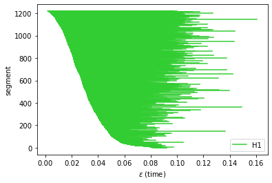

# Representation Topology Divergence: A Method for Comparing Neural Network Representations

This is an implementation of the algorithms from the paper https://arxiv.org/pdf/2201.00058

```
Barannikov, S., Trofimov, I., Balabin, N., & Burnaev, E. (2022).
Representation Topology Divergence: A Method for Comparing Neural Network Representations. ICML'22.
```

```Example.ipynb``` can be executed in [Google Colab](https://colab.research.google.com/github/IlyaTrofimov/RTD/blob/master/Example.ipynb).

### Installation
1. Requires numpy, scipy, torch.
2. Install ripserplusplus:
```pip install git+https://github.com/simonzhang00/ripser-plusplus.git```
3. Install RTD:
```pip install git+https://github.com/IlyaTrofimov/RTD.git```

Alternatively, you can use dockerfile.
In the docker, run ```conda activate py37``` after start. The directory ```RTD/experiments``` contains jupyter notebooks with experiments from the paper.

### Usage example
```python
import numpy as np
import rtd

np.random.seed(7)
P = np.random.rand(1000, 2)
Q = np.random.rand(1000, 2)

barc = rtd.calc_embed_dist(P, Q)
rtd.plot_barcodes(rtd.barc2array(barc))
```


```python
rtd.rtd(P, Q)
35.55234398557805
```
